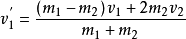
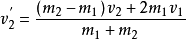
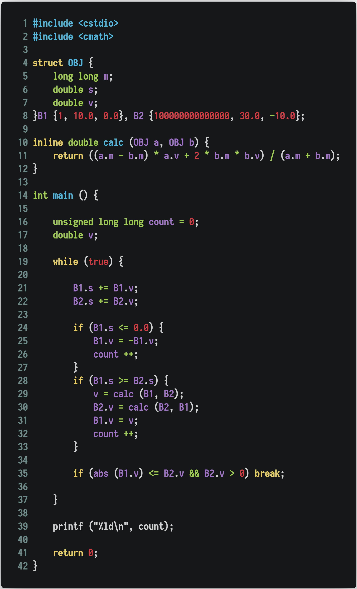

# Colliding Block
## 简单介绍
简单来说，这是一个很神奇的东西，但是讲讲，原理其实也不是很难。它的特别之处就是质量之比为 100^n 时，碰撞次数约等于 PI * 10^n。我第一次听说的时候和 3B1B 一样是很震惊的，不过由于还要上学我就没有特别去研究了。今天下午有个人出来问这个的问题，我动心了，自己也想做一个。这个就是成果了，不过动画做的不是那么好看，也就这样，不知道该放在哪个 REPO 里，但又不想建一个新的，就不管三七二十一放在了 CG 里。毕竟也是有图像处理相关的嘛，也不算是离题。

## 处理方式
### 方法一
动能守恒和动量守恒我们可以计算到一个很简单的式子，sqrt (N)*PI（N 是质量之比）（来源于[cv1881665](https://www.bilibili.com/read/cv1881665)）
是不是很震惊。

### 方法二（我的方法）
用物体碰撞后的速度公式  

  

我们可以计算出每次碰撞后的速度，然后不断模拟就是了  
<!--  -->

## 相关链接

[av40873215](https://www.bilibili.com/video/av40873215)
简单介绍了这个东西  
[av41712219](https://www.bilibili.com/video/av41712219)
原理解释了一遍，但并不唯一（比如我的虚拟实验法）