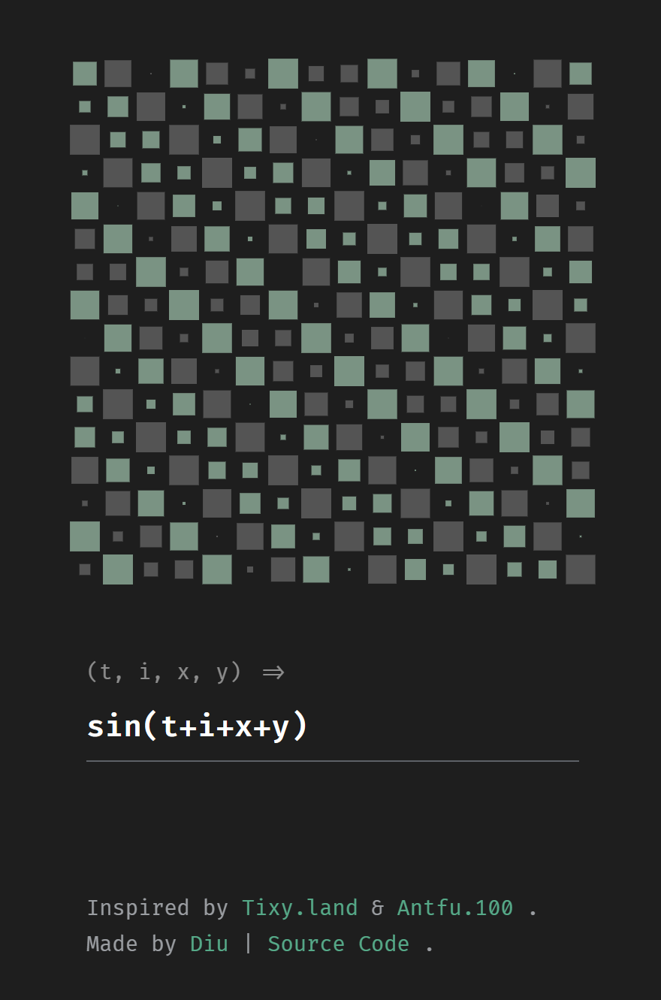

# TIXYZ

时间、索引、坐标

## 介绍

本项目参考了[tixy.land](https://tixy.land/)和[tin.ddiu.io](https://tin.ddiu.io/)

当时看到这两个项目的时候感觉还是挺有意思的，然后花了十几分钟的时间完成了这个项目的代码部分，采用 ege 对项目进行了简单的模仿，计划将来可能加入 js 或者 lua 脚本的支持，以及可能会有一些公式的自动渲染还有符合项目名称 y 的 3d 显示，不过那都是后话了。

## 如何编译

你只需要在自己的电脑上安装 xmake 和 一个编译器即可完成编译

或者确保环境变量中能够搜索到 g++ 编译器的情况下双击`build.bat`即可完成编译

只有一个`main.cpp`文件，应该随随便便不管用什么方式都可以完成编译

本项目依赖`EGE 20.08`以及`c++11`以上标准库

## 如何修改样式

代码中有一个func函数，对其返回值进行调整就可以修改整个图像的样式了，t的默认精度为`0.01`，你也可以对其进行修改，t实际增加速率为每秒60次（也就是画面刷新率60fps）

## 代码的LICENSE

本代码没有任何 license
